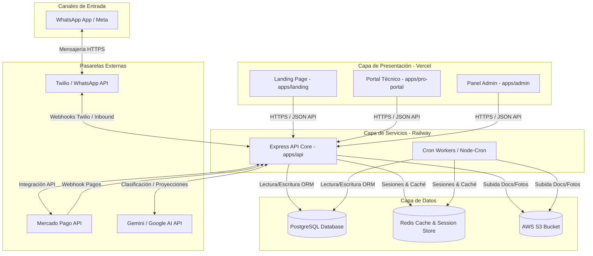

# ARCHITECTURE.md

## 1. Stack Tecnológico Detallado

* **Monorepositorio:** Gestionado con **PNPM Workspaces** y **Turborepo** (`turbo.json`).
* **Lenguaje:** **TypeScript** en todo el proyecto.
  * Backend API: TS ~5.0.0
  * Frontends: TS ~6.0.2 / ~5.9.3
* **Backend API (`apps/api`):**
  * **Framework Web:** Express.js (`^4.18.2`)
  * **ORM:** Prisma Client (`^5.10.2`)
  * **Persistencia:** PostgreSQL (Base de datos relacional)
  * **Caché y Sesiones:** Redis (ioredis `^5.10.1`)
  * **Servicios Externos:** Twilio API (WhatsApp SMS), Mercado Pago SDK (Preferencias y pagos), Resend (Mails), AWS SDK S3 (Almacenamiento de fotos/documentos de técnicos).
  * **Validación de Datos:** Zod (`^3.22.4`)
  * **Tareas Programadas (Crons):** `node-cron` (`^4.2.1`)
* **Frontend Applications:**
  * **Landing (`apps/landing`):** Next.js 14 (App Router), React, TailwindCSS.
  * **Admin Panel (`apps/admin`):** Next.js 14 (App Router), TanStack React Query, Lucide React, TailwindCSS.
  * **Pro Portal (`apps/pro-portal`):** Next.js 14 (App Router), TailwindCSS.

---

## 2. Diagrama de Arquitectura Conceptual

---

## 3. Desglose de Estructuras por Módulo

### A. API Backend (`apps/api/src`)
* `index.ts`: Punto de entrada Express. Configuración de middlewares globales (CORS, morgan, express.json), parsing de Webhook de Twilio, y ruteo principal.
* `/routes`: Define los routers Express.
  * `auth.routes.ts` / `auth.professional.routes.ts`: Autenticación de administradores y técnicos.
  * `webhook.routes.ts`: Maneja eventos entrantes de Twilio.
  * `operational-api.routes.ts`: Lógica operativa pesada (creación de solicitudes, ofertas, etc.).
  * `finance.ts`: Endpoints para el módulo financiero.
* `/controllers`: Manejadores de rutas Express. Contiene la validación inicial y llama a los servicios correspondientes.
* `/services`: Capa de lógica de negocio pura.
  * `conversation.service.ts`: Orquesta el bot de WhatsApp del usuario/cliente.
  * `professional.conversation.service.ts`: Orquesta la interacción conversacional del técnico.
  * `matching.service.ts`: Lógica de asignación algorítmica de técnicos según categorías y zonas.
  * `visit-flow.service.ts`: Flujo de cobro de visita técnica, reintentos y asignaciones.
  * `mercadopago.service.ts` y `whatsapp.service.ts`: Clases envolventes para APIs de terceros.
* `/agents`: Agentes específicos de IA que procesan mensajes específicos o generan reportes y análisis.
  * `finance-agent.ts`: Snapshots financieros diarios/semanales, alertas críticas y proyecciones usando prompts Gemini.
  * `forecast-agent.ts`: Predicción de la demanda por zona y categoría para la próxima semana.
  * `availability-agent.ts` / `quality-agent.ts` / `fraud-agent.ts`: Agentes operativos autónomos.

### B. Compartido (`packages/`)
* `packages/db`: Contiene el esquema de base de datos Prisma (`schema.prisma`), scripts de seeds (crear admin y técnicos de prueba) y exporta la instancia del cliente Prisma.
* `packages/types` y `packages/utils`: Tipados comunes y funciones auxiliares compartidas.

---

## 4. Persistencia y Caché

### Esquema Conceptual de PostgreSQL
* **User (`users`):** Clientes. Clave primaria por número de teléfono (`phone`).
* **Professional (`professionals`):** Técnicos. Campos para categorías (Rubros), zonas de trabajo (cobertura), horarios (`schedule_json`), estado de onboarding, documentación asociada, CBU/Alias y rating acumulado.
* **ProfessionalDocument (`professional_documents`):** Archivos subidos por técnicos. Tipo DNI frente, DNI dorso, y certificación, con su `storage_key` correspondiente en S3.
* **ServiceRequest (`service_requests`):** Solicitudes de servicio. Guardan fotos, categoría, dirección, prioridad (`urgent` / `scheduled`), y tarifa de visita pactada.
* **JobOffer (`job_offers`):** Instancias de asignación de una solicitud a un técnico. Estados: `pending`, `held` (reservado), `accepted`, `rejected`, `expired`.
* **Quotation (`quotations`):** Presupuestos. Vinculados a una oferta. Tipo `visit` o `repair`.
* **Payment (`payments`):** Pagos generados para una cotización específica con identificadores de Mercado Pago (`mp_payment_id`).
* **Job (`jobs`):** Estado del trabajo una vez abonada la visita. Contiene rating final, review textual del cliente, y fecha de liberación de fondos (`payment_released_at`).
* **Earning (`earnings`):** Registro de cálculo financiero neto de ganancias para el técnico por cada trabajo.
* **Módulo Financiero / Agente:**
  * `demand_forecasts`: Predicciones de demanda semanales.
  * `expansion_opportunities`: Oportunidades de expansión detectadas por brechas de cobertura.
  * `finance_alerts`: Alertas de desvíos, caídas de ingresos y comisiones bajas.
  * `finance_projections`: Proyecciones financieras mensuales auto-generadas por Gemini.
  * `finance_snapshots`: Historial consolidado diario, semanal y mensual.
  * `mp_reconciliation`: Reporte de conciliación diario con Mercado Pago.

### Casos de Uso de Redis
1. **Sesiones de Conversación Activa:**
   * Almacena el estado/paso de la conversación del bot de WhatsApp (`session:${phone}`) para evitar golpear la base de datos de PostgreSQL en cada mensaje entrante. TTL configurado en 24 horas.
   * Almacena el paso de onboarding/operaciones del técnico (`pro_session:${phone}`).
2. **Caché Financiero y Alertas:**
   * Almacena datos precalculados de proyecciones y consolidados de facturación.
   * Controla alertas no resueltas de manera eficiente.
3. **Control de Flujo de Mensajería (Mediación):**
   * Gestiona el ruteo dinámico de mensajes de chat directo cliente-técnico temporal (`mediation:direction:${phone}`) durante la ejecución de un trabajo activo.

---

## 5. Convenciones de Código y Decisiones de Diseño

### Estilo de Código y Convenciones Técnicas
* **Tipado Estricto:** TypeScript estricto. Tipos compartidos definidos en `packages/types`. Esquemas de validación Zod en controladores de la API.
* **Nombrado de Base de Datos:** Los campos en PostgreSQL utilizan **snake_case** (ej. `professional_id`, `is_urgent`, `created_at`). Mapeados mediante `@map` en `packages/db/prisma/schema.prisma`.
* **Nombrado de Código TS:** Convención **camelCase** para variables, funciones y atributos de clases; **PascalCase** para clases y enums.
* **Manejo de Errores en API:** Los endpoints Express deben pasar los errores capturados en bloques `catch` al middleware global llamando a `next(error)`. Evitar responder directamente con códigos de error dentro de los controladores.
* **Uso de Redis:** Siempre envolver las llamadas a Redis con un manejador de límite de tiempo (timeout) para evitar bloquear el hilo de Express si Redis pierde conexión. Usar `withRedisTimeout` en `ConversationService`.

### Decisiones Técnicas Clave
* **Orquestación del Bot de WhatsApp:** Dos servicios centrales en `apps/api/src/services`:
  * `conversation.service.ts` para clientes.
  * `professional.conversation.service.ts` para técnicos.
* **Mediación y Custodia de Pagos:** Servy retiene el pago del arreglo (`repair`) mediante Mercado Pago y solo lo libera al técnico cuando el cliente escanea el código QR generado por `QRService`.
