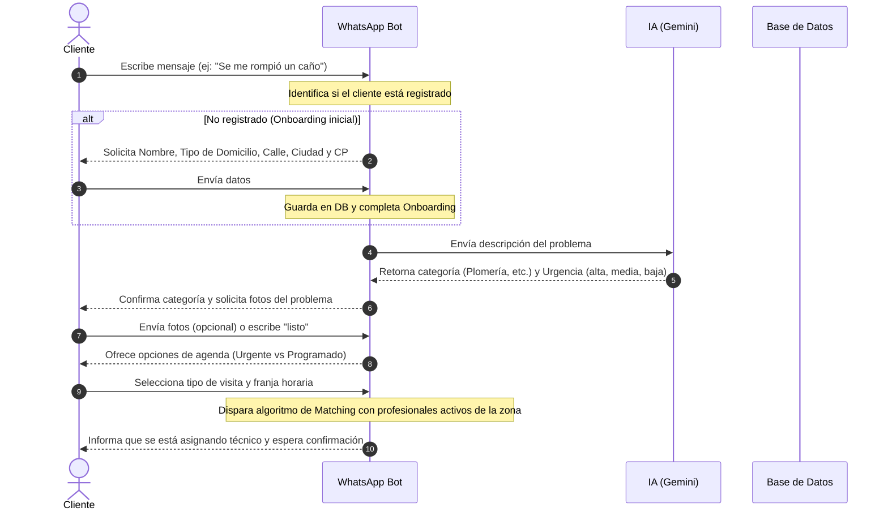
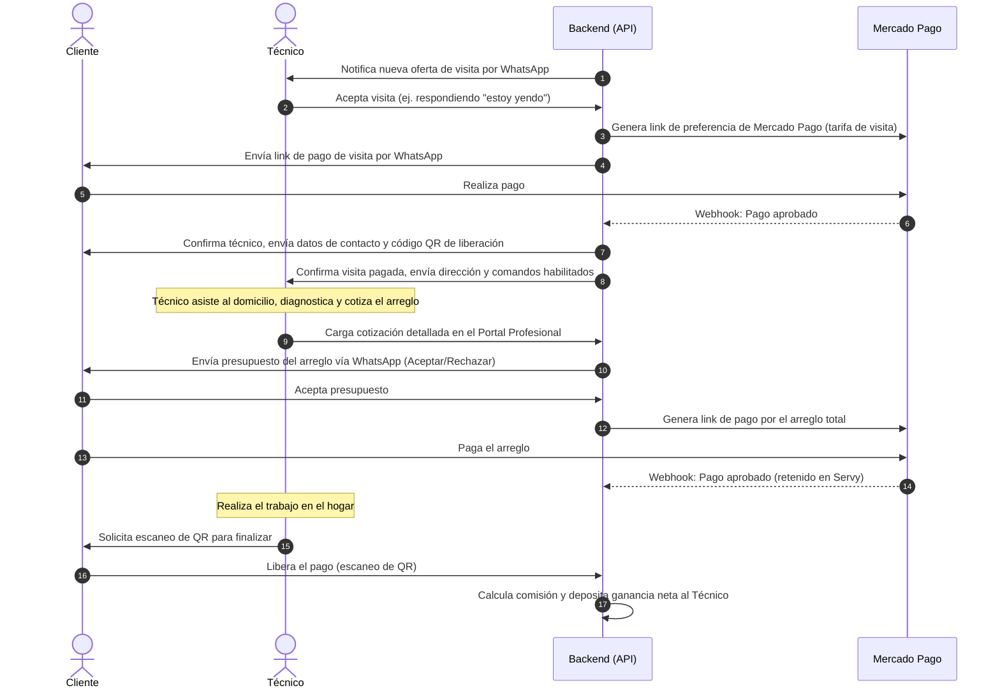

# PRODUCT_DESCRIPTION.md

## 1. Visión General y Propuesta de Valor

Servy es una plataforma digital (marketplace) que conecta **clientes que necesitan resolver urgencias o tareas de mantenimiento en sus hogares** con **profesionales de oficios técnicos verificados** en Argentina.

### Problema que Resuelve
* **Para Clientes:** Falta de confianza al contratar técnicos, asimetría de información sobre precios de mercado (especialmente en urgencias), y dificultad para encontrar técnicos disponibles en franjas horarias específicas.
* **Para Profesionales:** Dificultad para conseguir clientes locales, falta de herramientas para gestionar cobros/presupuestos de forma transparente, y ausencia de un sistema de reputación confiable.

### Propuesta de Valor
* **Mediación y Confianza:** Servy actúa como intermediario confiable. Los cobros de las visitas diagnósticas y de los arreglos se realizan de forma segura y quedan retenidos en la plataforma hasta que el cliente confirma que el trabajo fue finalizado (mediante firma digital/QR).
* **Velocidad y Clasificación Automática:** Automatización de la clasificación de solicitudes por urgencia usando IA (Gemini).
* **Flexibilidad de Agendamiento:** Permite coordinar visitas inmediatas ("Urgentes" - menos de 24 hs) o "Programadas" (hasta 72 hs) con tarifas claras.

---

## 2. Aplicaciones y Módulos del Sistema

El ecosistema de Servy está compuesto por **4 aplicaciones principales** organizadas en un monorepositorio:

### 1. Landing Page (`apps/landing`)
* **Rol:** Portal público de atracción y captación.
* **Funcionalidad:**
  * Presentación de la propuesta de valor a clientes finales.
  * Sección dedicada para la conversión y registro inicial de profesionales técnicos (`/tecnicos`, `/profesionales`).
  * Captura de leads técnicos mediante un formulario integrado.

### 2. Portal del Profesional (`apps/pro-portal`)
* **Rol:** Panel web privado para los profesionales técnicos.
* **Funcionalidad:**
  * **Onboarding Web:** Carga de datos de perfil, CBU/Alias, DNI (frente y dorso) y certificados para validación.
  * **Operación diaria:** Visualizar ofertas activas, enviar presupuestos detallados en formato JSON (descripción + precio por ítem), y consultar historial de trabajos y ganancias netas acumuladas.
  * **Autenticación:** Login, registro, recuperación y seteo de contraseñas.

### 3. Panel de Administración (`apps/admin`)
* **Rol:** Panel interno de operaciones e inteligencia de negocio.
* **Funcionalidad:**
  * Aprobación, rechazo y suspensión de perfiles de profesionales.
  * Gestión de solicitudes de servicio, ofertas de trabajo, reclamos e incidencias.
  * **Módulo Financiero Avanzado:** Visualización de ingresos brutos, comisiones recaudadas, tasas de cancelación, alertas críticas de ingresos, proyecciones basadas en IA (Gemini) y conciliaciones diarias con Mercado Pago.

### 4. API Backend Core (`apps/api`)
* **Rol:** Motor transaccional del sistema y orquestador de agentes de IA.
* **Funcionalidad:**
  * Expone endpoints HTTP de las aplicaciones de front.
  * Integra Webhooks críticos: **Twilio** (recepción/envío de mensajes en WhatsApp) y **Mercado Pago** (notificaciones de estado de pagos en tiempo real).
  * Ejecuta trabajos en segundo plano (crons) para cálculos financieros, alertas y reconciliaciones.

---

## 3. Flujos Principales de Usuario

### A. Flujo de Pedido del Cliente (Vía WhatsApp / Twilio)

### B. Flujo de Asignación, Pago de Visita y Arreglo

### C. Flujo de Onboarding de Profesionales (Híbrido WhatsApp / Web)
1. **Contacto Inicial:** El profesional se registra en el formulario de la Landing o inicia conversación vía WhatsApp eligiendo la opción *"Soy técnico y quiero registrarme"*.
2. **Asistente de Registro (WhatsApp Wizard):** El bot le solicita DNI, Email, Rubros en los que trabaja, Zonas de cobertura y CBU/Alias.
3. **Portal Web:** Se le envía un link para establecer su contraseña y acceder al portal (`apps/pro-portal`).
4. **Validación Documental:** El técnico sube fotos de su DNI (Frente/Dorso) y certificaciones en el portal. Su estado queda en `pending`.
5. **Aprobación Admin:** El administrador valida la documentación en `apps/admin` y cambia el estado del profesional a `active` para que comience a recibir ofertas.

---

## 4. Glosario de Términos del Negocio

* **User (Cliente):** Persona que solicita soporte técnico para su hogar. Se identifica unívocamente por su número de teléfono.
* **Professional (Técnico / Proveedor):** Profesional independiente de oficios habilitado en la plataforma para presupuestar y realizar trabajos.
* **Service Request (Pedido de Servicio):** Solicitud creada por un cliente que describe una avería técnica en una dirección dada.
* **Job Offer (Oferta de Trabajo):** Instancia de vinculación de un `Service Request` con un técnico potencial tras la ejecución del algoritmo de Matching. Puede estar en estados: `pending`, `held`, `accepted`, `rejected`, `expired`, etc.
* **Quotation (Cotización / Presupuesto):** Documento económico asociado al trabajo. Existen dos tipos:
  * **Visit Fee (Tarifa de Visita):** Valor fijo obligatorio para que el técnico asista a diagnosticar (varía según urgencia).
  * **Repair Fee (Presupuesto del Arreglo):** Cotización detallada de mano de obra generada por el técnico in situ.
* **Payment (Pago):** Transacción monetaria procesada por Mercado Pago. Puede ser de tipo `visit` o `repair`.
* **Job (Trabajo):** Ciclo operativo del arreglo una vez que la visita de diagnóstico fue cobrada.
* **Earning (Ganancia):** Registro financiero que calcula el monto bruto cobrado, la comisión de la plataforma (ej. 12%), el costo de pasarela de pago (Mercado Pago), y el monto neto a transferir al profesional.
