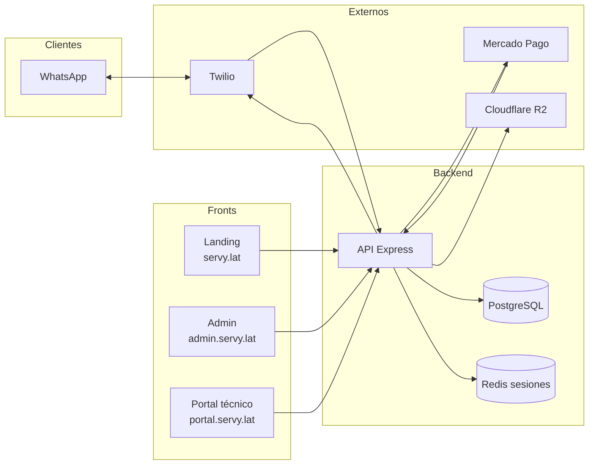
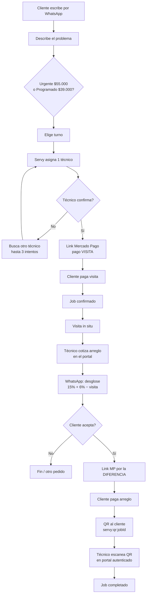
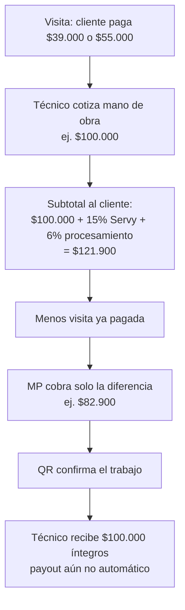
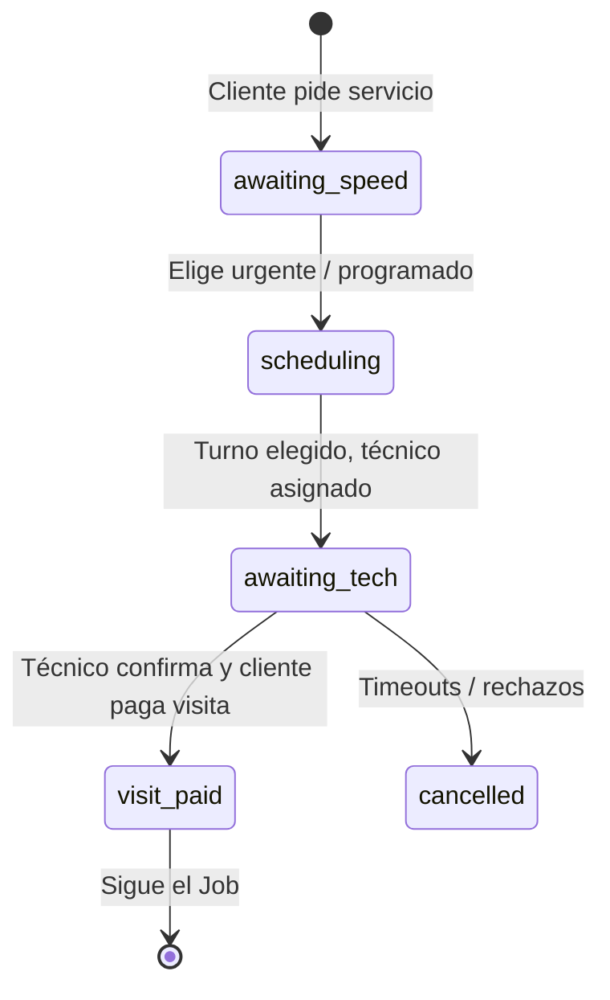
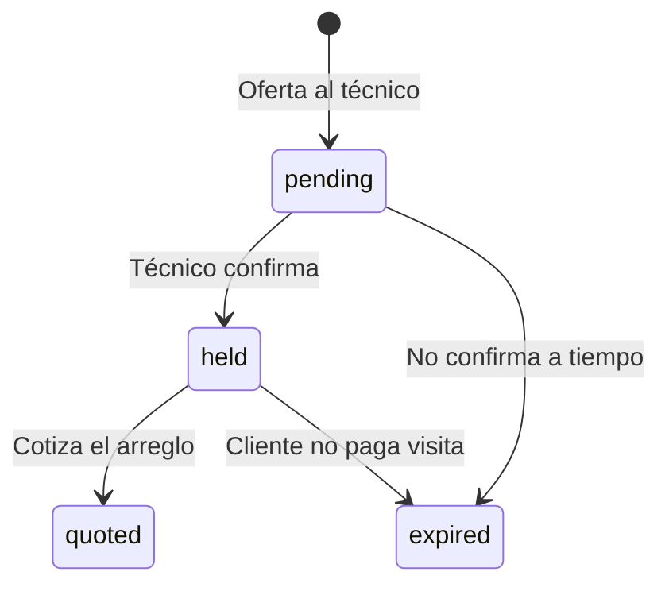
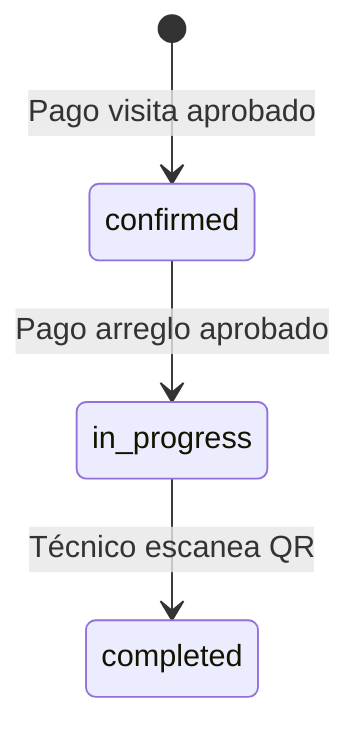
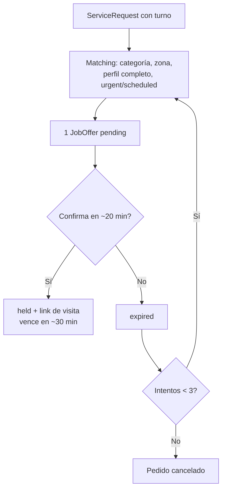

# Flujo de Servy

Diagramas del producto actual (WhatsApp + visita como seña + arreglo).  
Para exportar a PNG/SVG: copiá un bloque ` ```mermaid ` en [mermaid.live](https://mermaid.live) → **Actions**.

Zona piloto: **Pilar, Buenos Aires**. Canal: **Twilio WhatsApp**. Pagos: **Mercado Pago**.

---

## 1. Arquitectura



---

## 2. Flujo completo (cliente + técnico)



---

## 3. Precios y comisiones (arreglo)

El técnico cotiza **mano de obra neta**. El cliente ve el markup. La visita ya pagada se descuenta.



**Fórmula** (`apps/api/src/services/repair-pricing.ts`):

```
mano de obra
+ 15% comisión Servy
+ 6% sobre (mano de obra + comisión)
− visita ya abonada
= monto del link de Mercado Pago
```

---

## 4. Estados (backend)







---

## 5. Matching y timeouts



---

## 6. Apps del monorepo

| App | URL típica | Rol |
|-----|------------|-----|
| `apps/api` | API / Railway | Webhooks, matching, pagos, crons |
| `apps/landing` | servy.lat | Sitio público |
| `apps/admin` | admin.servy.lat | Operación interna |
| `apps/pro-portal` | portal.servy.lat | Cotizar, jobs, escanear QR |

El **cliente final no usa web**: todo el pedido es WhatsApp.
