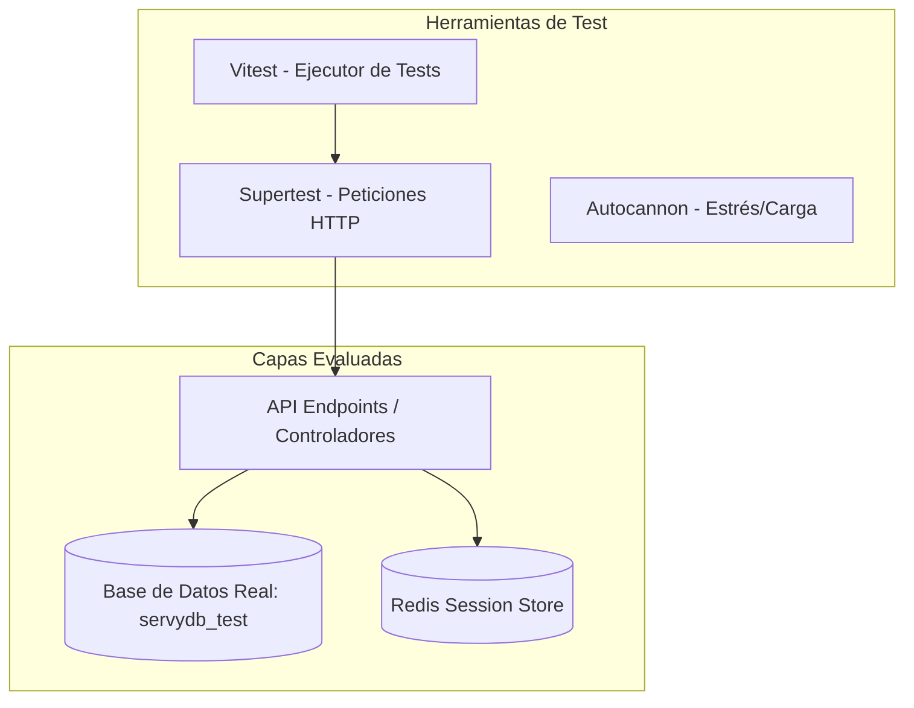

# Plan de Pruebas, Entornos de Datos y Scripting para Validación de Refactorización (Servy Backend)

Este plan tiene como objetivo preparar una suite de pruebas automatizadas, bases de datos de test, scripts de estrés y pruebas de vulnerabilidad para el backend de Servy (`apps/api`). Esto permitirá al equipo de desarrollo realizar pruebas antes y después de cualquier refactorización para garantizar que no se pierda funcionalidad ni se introduzcan regresiones.

---

## 1. Estrategia y Arquitectura de Pruebas

Utilizaremos una combinación de pruebas unitarias, de integración, de seguridad y de carga para garantizar la robustez del sistema:



### Herramientas Utilizadas:
1. **Vitest:** Ejecutor de pruebas principal. Elegido por su altísima velocidad, soporte nativo de TypeScript/ESM y compatibilidad con el entorno de monorepositorio.
2. **Supertest:** Permite realizar peticiones HTTP virtuales al servidor Express (`app`) sin necesidad de levantar el puerto de red real durante las pruebas de integración.
3. **Prisma Client (Real):** Apuntará a `servydb_test` para garantizar que las consultas, constraints (claves foráneas, unicidad) y triggers funcionen exactamente igual que en producción.
4. **Mocks de Terceros:** Servicios externos (Twilio, Mercado Pago, AWS S3, Resend) se interceptarán mediante mocks en `setup.ts` para evitar dependencias de red o costos durante las pruebas.

---

## 2. Inclusión y Validación de Tests Existentes (`src/__tests__`)

> [!IMPORTANT]
> **Preservación de Pruebas Existentes:**
> Todos los tests existentes localizados en [src/\_\_tests\_\_](file:///D:/ThisPc/Documentos/Proyectos/Servyapp/apps/api/src/__tests__) están completamente integrados y son ejecutados como primera línea de defensa antes de la refactorización. Estos tests cubren:
> * [auth.test.ts](file:///D:/ThisPc/Documentos/Proyectos/Servyapp/apps/api/src/__tests__/auth.test.ts) (Autenticación).
> * [endpoints.test.ts](file:///D:/ThisPc/Documentos/Proyectos/Servyapp/apps/api/src/__tests__/endpoints.test.ts) (Endpoints generales).
> * [error.test.ts](file:///D:/ThisPc/Documentos/Proyectos/Servyapp/apps/api/src/__tests__/error.test.ts) (Mapeador de errores).
> * [integration.test.ts](file:///D:/ThisPc/Documentos/Proyectos/Servyapp/apps/api/src/__tests__/integration.test.ts) (Integración básica /health).
> * [matching.test.ts](file:///D:/ThisPc/Documentos/Proyectos/Servyapp/apps/api/src/__tests__/matching.test.ts) (Algoritmo de emparejamiento de técnicos).
> * [whatsapp.test.ts](file:///D:/ThisPc/Documentos/Proyectos/Servyapp/apps/api/src/__tests__/whatsapp.test.ts) (Flujo del webhook de WhatsApp).
>
> Durante la ejecución del plan, garantizaremos que estos 16 tests existentes sigan pasando (`100% pass`) tras la introducción de las nuevas herramientas y las futuras refactorizaciones.

---

## 3. Tipos de Usuario y Flujos Críticos a Evaluar

Basado en el plan de flujos de usuario, diseñaremos pruebas que abarquen los siguientes tipos de usuario e interacciones de punta a punta:

### Matriz de Usuarios y Canales

| Tipo de Usuario | Identificador Único | Canal Principal | Tabla en BD |
| :--- | :--- | :--- | :--- |
| **Cliente (User)** | Teléfono | WhatsApp Bot | `users` |
| **Profesional / Técnico** | Teléfono, Email, DNI | WhatsApp Wizard + Portal Web | `professionals` (Estados: `pending` $\rightarrow$ `active` / `suspended`) |
| **Administrador** | Email, Password | Admin Panel | Tabla dedicada de administradores |

---

### Flujos Principales y Casos de Prueba Integrales

#### **FLUJO A: Cliente — Pedido de Servicio (WhatsApp)**
1. **Onboarding Inicial:** Simular mensaje entrante de cliente no registrado y validar el guardado de datos (nombre, domicilio, CP).
2. **Clasificación IA (Gemini Mock):** Verificar que la descripción del problema se clasifica correctamente por rubro y urgencia (alta, media, baja).
3. **Selección de Agenda:** Simular elección de visita Urgente (<24h) vs Programada ($\le$72h) y franja horaria.
4. **Matching Automático:** Verificar el matching de profesionales aptos en la zona basándose en el CP y disponibilidad.

#### **FLUJO B: Asignación, Pago de Visita y Arreglo**
1. **Notificación al Técnico:** Validar envío de la oferta de trabajo (`JobOffer`) al profesional seleccionado.
2. **Aceptación de Visita:** Simular respuesta afirmativa ("estoy yendo") y transición de la oferta a estado `held`/`accepted`.
3. **Simulación de Mercado Pago Webhook:**
   * Simular la aprobación del pago de visita (`visit_fee`).
   * **Idempotencia:** Enviar el mismo evento de pago repetidamente y verificar que la transacción solo se procese una vez.
   * Transición del trabajo a `in_progress` y envío de datos del técnico + **código QR de liberación** al cliente.
4. **Carga de Cotización:** Simular carga de cotización detallada (`repair`) por el técnico en el Portal Profesional.
5. **Aceptación and Retención:** Simular aceptación del cliente y el pago retenido del arreglo en Mercado Pago.
6. **Validación de Flujo QR:**
   * Simular escaneo de QR por parte del cliente para finalizar el trabajo.
   * Validar actualización de `payment_released_at` en la tabla `jobs`.
   * **Cálculo de Comisión:** Verificar que el sistema calcula correctamente la comisión del 12% + cargos de Mercado Pago, asignando el monto neto exacto en la tabla `earnings` para el profesional.

#### **FLUJO C: Onboarding Profesional (Híbrido WhatsApp + Web)**
1. **Wizard de Registro:** Captura de datos básicos (DNI, email, rubros, CBU) vía WhatsApp.
2. **Subida Documental y Formatos:**
   * Intentar subir archivos en formatos válidos (`PDF`, `JPG`, `PNG`) y validar que se guarden en S3 de prueba.
   * Intentar subir formatos inválidos (ej. `.exe`, `.js`) y verificar el rechazo con código `400`.
   * El estado del técnico debe quedar en `pending`.
3. **Aprobación Admin:** Endpoint de aprobación que transiciona el estado a `active`.

#### **FLUJO D: Administrador (Panel Interno)**
1. Simular la suspensión y reactivación de perfiles técnicos.
2. Validar endpoints del módulo financiero: agregados brutos, comisiones recaudadas, alertas automáticas de IA y reportes de conciliación diaria de Mercado Pago.

---

## 4. Estados Clave Monitoreados en la Base de Datos

Las pruebas de integración assertarán los cambios de estado correspondientes en las entidades:

* **`JobOffer`:** `pending` $\rightarrow$ `held` $\rightarrow$ `accepted` / `rejected` / `expired`
* **`Quotation`:** `visit` (tarifa fija de diagnóstico) / `repair` (presupuesto del arreglo)
* **`Payment`:** `visit` / `repair` $\rightarrow$ `pending` $\rightarrow$ `approved` / `rejected` / `refunded`
* **`Job`:** `in_progress` $\rightarrow$ `completed` (QR escaneado)
* **`Professional`:** `pending` $\rightarrow$ `active` / `suspended`

---

## 5. Pruebas por Base de Datos e Infraestructura

Para garantizar que los cambios en Prisma o en las consultas (ej. evitar N+1 y queries inseguras) funcionen correctamente:

* **Aislamiento de Datos:** Antes de cada test (`beforeEach`), se ejecutará un script que limpia las tablas en el orden correcto de dependencias para asegurar un estado limpio.
* **Esquema Sincronizado:** El script de inicialización correrá `prisma db push` sobre la base `servydb_test` para asegurar que el esquema de pruebas coincida exactamente con el de desarrollo.
* **Validación de Consultas Seguras y Desempeño:**
  * **Fix N+1:** Validar mediante pruebas que los métodos críticos (ej. `matching.service.ts`) usan `findMany` con la cláusula `in` para reducir el número de queries a la base de datos.
  * **Desacoplamiento Cron:** Validar mediante pruebas que los crons pesados delegan tareas asíncronas usando BullMQ sobre la instancia de Redis, en lugar de bloquear el event-loop principal.

---

## 6. Pruebas de Vulnerabilidad (Seguridad)

Pruebas automatizadas específicas diseñadas para detectar fallos comunes de seguridad de OWASP Top 10:

* **Sanitización SQL (Inyección):** Asegurar que las llamadas raw como `$executeRaw` en `finance-agent.ts` usen plantillas tipadas y parametrizadas nativas de Prisma en lugar de strings interpolados.
* **Falta de Autorización (BOLA/IDOR):** Intentar acceder a endpoints del portal profesional usando un token JWT que pertenece a otro profesional, o sin token, esperando respuestas `401 Unauthorized` o `403 Forbidden`.
* **Polución de Parámetros (HPP):** Enviar arreglos en lugar de cadenas de texto (ej. `?phone=123&phone=456`) para verificar que Express y Zod no se confundan y procesen información errónea.

---

## 7. Pruebas de Estrés y Carga (Stress Testing)

Utilizaremos **Autocannon** para enviar miles de peticiones simultáneas al backend. 

### Escenarios Configurados:
1. **Línea Base (Health Check):** Petición a `/health` para medir la capacidad cruda del framework Express sin base de datos (meta: > 2000 RPS).
2. **Uso de Base de Datos (Auth Login):** Petición concurrente a `/auth/professional/login` con credenciales inválidas para evaluar el impacto de la criptografía (Bcrypt) y latencia de base de datos bajo carga (meta: > 100 RPS sostenidos).
3. **Escenario Complejo (WhatsApp Webhook):** Simulación de webhooks concurrentes entrantes de Twilio que consultan Redis y escriben estados en la base de datos (meta: > 300 RPS sin timeouts).

---

## 8. Roadmap de Implementación y Seguimiento

Para llevar un control ordenado del progreso, dividiremos el trabajo en las siguientes fases consecutivas:

```mermaid
gantt
    title Roadmap de Pruebas y Preparación
    dateFormat  YYYY-MM-DD
    section Fase 1
    Configuración de Entorno & Dependencias      :active, f1, 2026-06-15, 1d
    section Fase 2
    Test DB Setup & Limpieza Automática         :after f1, f2, 1d
    section Fase 3
    Pruebas de Integración de Flujos de Usuario :after f2, f3, 2d
    section Fase 4
    Pruebas de Vulnerabilidades & Seguridad     :after f3, f4, 1d
    section Fase 5
    Pruebas de Estrés (Autocannon)              :after f4, f5, 1d
    section Fase 6
    Documentación (TEST_STRATEGY.md / GEMINI.md):after f5, f6, 1d
```

* **Fase 1: Configuración de Entorno:** Instalación de herramientas de desarrollo (`autocannon`, tipos necesarios) y actualización de scripts en `package.json`.
* **Fase 2: Base de Datos de Prueba:** Creación de `test-db-setup.ts` para crear, migrar y truncar la base de datos `servydb_test`.
* **Fase 3: Pruebas de Integración:** Codificación del archivo `integration-real-db.test.ts` cubriendo los flujos A, B, C y D de punta a punta.
* **Fase 4: Pruebas de Seguridad:** Codificación de `security-vulnerability.test.ts` con escenarios OWASP Top 10 (SQLi, IDOR, HPP, etc.).
* **Fase 5: Pruebas de Estrés:** Implementación de `stress-test.ts` con Autocannon y validación de las metas de RPS.
* **Fase 6: Documentación & Enlace:** Redacción de `TEST_STRATEGY.md` y vinculación en `GEMINI.md`.
